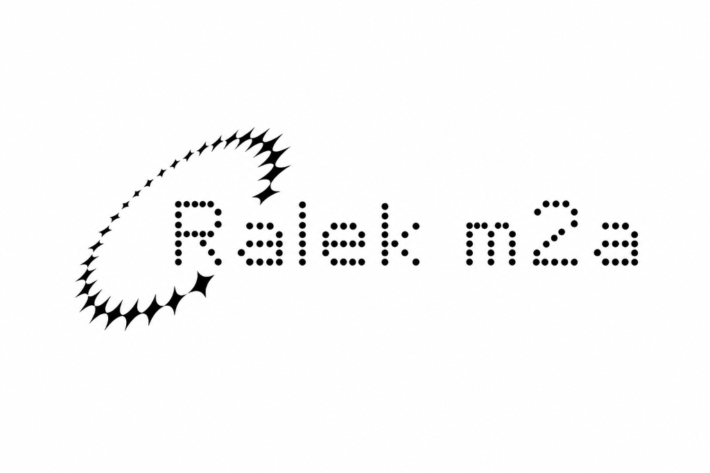
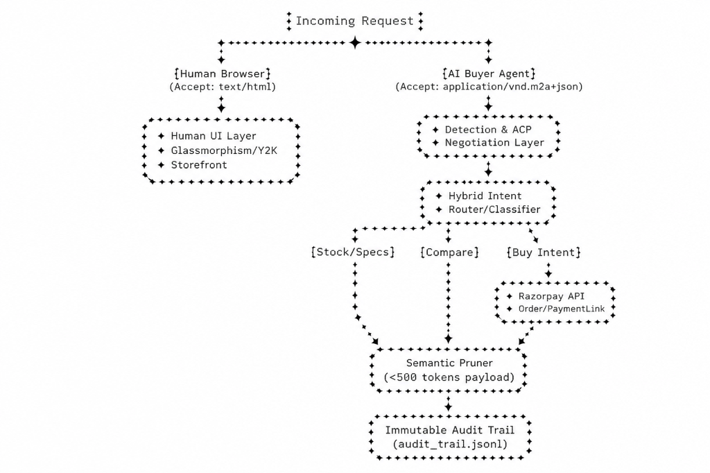

<div align="center">
  
</div>

<h1 align="center">RALEK M2A</h1>
<p align="center">
  <b>The Dual-Reality E-Commerce Infrastructure for the Agentic Web</b><br/>
  <a href="#about-the-project">About</a> •
  <a href="#architecture">Architecture</a> •
  <a href="#technologies-used">Tech Stack</a> •
  <a href="#installation--getting-started">Installation</a> •
  <a href="#future-additions">Future Additions</a>
</p>

<div align="center">

[](https://www.python.org)
[](https://flask.palletsprojects.com/)
[](https://razorpay.com/)

</div>

## About The Project

Current e-commerce websites are designed for human eyes—heavy with CSS, animations, and massive DOM trees. When AI Shopping Agents (like ChatGPT, AutoGPT, or custom bots) try to crawl these sites, they waste massive amounts of LLM context tokens, increase latency, and cost API money.

**RALEK M2A (Merchant-to-Agent)** is a middleware layer that creates a "Dual-Reality" storefront:
- **For Humans:** Renders a beautiful, cinematic, scroll-driven website.
- **For AI Agents:** Intercepts the request, uses NLP to classify shopping intent, prunes unnecessary visual data, and returns an ultra-lightweight JSON payload—complete with a dynamic **Razorpay checkout link**.

---

## Architecture

<div align="center">
  
</div>

### The 5 Core Layers:
1. **Detection (`detector.py`):** Passive (User-Agent) and Active (`Signature-Agent: 1`) bot detection. Uses `Vary` HTTP headers to protect SEO.
2. **Classification (`classifier.py`):** Machine Learning (TF-IDF + Logistic Regression) categorizes natural language queries into `BUY`, `STOCK`, `SPECS`, or `BROWSE`.
3. **Semantic Pruner (`pruner.py`):** Strips 80%+ of irrelevant JSON keys based on intent (e.g., removing dimensions when an AI only asks for stock count).
4. **Payments (`payments.py`):** Dynamically generates Razorpay checkout links if intent is `BUY`. Includes a hard AI spend-cap for safety.
5. **Audit Trail (`audit.py`):** Immutable `.jsonl` telemetry logging of every AI interaction.

---

## Technologies Used

- **Backend Core:** `Python 3`, `Flask`, `Gunicorn`
- **Machine Learning / NLP:** `scikit-learn`, `nlpaug` (for typo resilience and data augmentation)
- **Token Math:** `tiktoken` (OpenAI cl100k_base deterministic token counting)
- **Payments:** `Razorpay Python SDK`
- **Frontend (Humans & Dashboard):** HTML5, GSAP, CSS3, Chart.js
- **Deployment:** Render / Heroku-ready (`Procfile` included)

---

## Installation & Getting Started

### 1. Clone the repository
```bash
git clone https://github.com/Ashira-senthal/RALEK.git
cd RALEK
```

### 2. Install dependencies
```bash
pip install -r requirements.txt
```

### 3. Environment Variables
Create a `.env` file in the root directory and add your test Razorpay keys:
```env
RAZORPAY_KEY_ID="rzp_test_xxxxxxxxxxx"
RAZORPAY_KEY_SECRET="xxxxxxxxxxxxxxx"
```

### 4. Run the Application
```bash
python3 app.py
```
The server will start at `http://localhost:5000`.

---

## Usage & Testing

### The Human View
Open your browser and navigate to `http://localhost:5000` to see the heavy cinematic frontend.

### Live Analytics Dashboard (For Demos)
Visit `http://localhost:5000/dashboard` to test AI natural language queries and see real-time token reduction metrics, side-by-side payload comparisons, and Razorpay links.

### AI Agent API Simulation
You can use `curl` to simulate an AI agent requesting a product:

```bash
# Simulating a BUY intent via Natural Language
curl -H "Signature-Agent: 1" \
     -H "Accept: application/vnd.m2a+json" \
     "http://localhost:5000/product/prod_001?query=I+want+to+purchase+this"
```

---

## Future Additions

**Disclaimer:** *The project currently serves as a functional MVP and Proof of Concept. It still requires some additions before broad production deployment, as it has currently only been tested on the default mock catalog with Razorpay test keys.*

The following expansions are scheduled for the next phase:

- [ ] **Database Adapters:** Decouple `m2a/catalog.py` to support plug-and-play PostgreSQL and MongoDB connections for real merchant catalogs.
- [ ] **Multi-Currency Support:** Expand Razorpay integration beyond INR to handle global Agent transactions.
- [ ] **Caching Layer:** Implement Redis caching for intent classification to reduce inference latency.
- [ ] **Shopify App Packaging:** Package the `m2a` core into a 1-click installable Shopify plugin.
- [ ] **Enhanced Authentication:** Add OAuth/OIDC validation for trusted AI agents.
